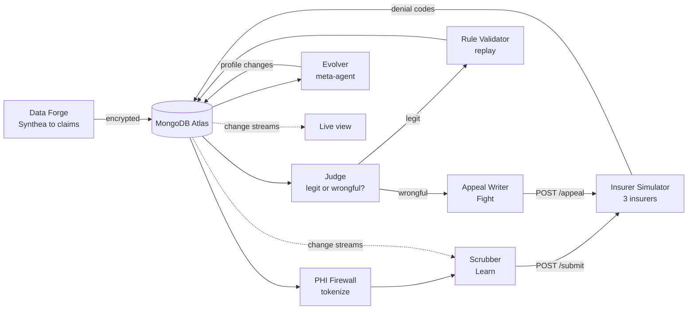

# Claim Cipher

> **Insurers use algorithms to deny claims. We built a self-improving agent that learns each insurer's hidden behavior, catches wrongful denials, and fights back with evidence-based appeals, without ever showing patient data to the AI.**

Built at the MongoDB Harness Engineering & Model Wrangling Hackathon, Saturday Sept 26, 2026. Billing operations only: no diagnosis, no treatment, no medical advice. All data is synthetic.

---

## What it does

The agent runs in a loop all day, per insurer:

1. **Learn:** works out each insurer's hidden rules from its denials and fixes claims before sending them.
2. **Judge:** decides whether each denial is legitimate or **wrongful** (contradicts the insurer's own published policy, or looks like an automated bulk denial).
3. **Fight:** drafts and files evidence-based appeals, then learns which evidence wins with each insurer.
4. **Evolve:** rewrites its own per-insurer harness (rules, context policy, thresholds, appeal strategy, guardrails, tool permissions), with automatic rollback when a change makes results worse.

Underneath: a **PHI firewall**. Patient fields are encrypted with MongoDB Queryable Encryption, and the LLM only ever sees tokens such as `PATIENT_4821` and age bands.

The engine is generic: any insurance line with a policy, a claim and an appeal can plug in. Health insurance is the first use case.

---

## How it works



| Component | What it does | Where |
| --- | --- | --- |
| Data Forge | Synthea patients and encounters → ~2,000 claims on a public ICD-10-CM / HCPCS Level II code set; PHI planted in ~5% of notes as a red-team test; 20% of claims held out for scoring | `forge/` |
| Insurer simulator | Deterministic FastAPI service (no LLM): 3 insurers with hidden rules, planted wrongful behavior, per-insurer appeal logic, and a Payer C policy change | `sim/` |
| Scorer | The only code that reads ground truth; writes acceptance, Judge precision/recall, appeal wins, dollars recovered and PHI leaks every 30 s | `scorer/` |
| PHI firewall | Queryable Encryption on patient fields, tokenization before the LLM, leak detector on every LLM request and response | `firewall/` |
| Rule validator | Replays candidate rules and Judge thresholds over past claims with aggregation pipelines; promotes, rejects or retires | `validator/` |
| Agents | Scrubber, Judge, Appeal Writer, Evolver (bounded self-changes with automatic rollback), Trust Ladder (draft-only → auto-file) | `agents/` |
| Orchestrator | Async loop: tokenize → scrub → submit → judge → appeal, Evolver cycles, filing of human-approved appeals | `orchestrator/` |
| Live view | Scoreboard, claim stream, appeals with approve button, harness changes, "Why?" drawer, fed by MongoDB change streams over Server-Sent Events | `web/` |

The agents never see the hidden rules or the ground truth. They learn only from what a real billing team gets: denial codes, the published policy and appeal outcomes. The score is measured on held-out claims.

### MongoDB features doing real work

| Feature | Used for |
| --- | --- |
| Queryable Encryption | Patient fields in `claims` and `phi_tokens` are never stored or queried in plain text |
| Vector Search | Retrieving the policy clauses relevant to a denial (`policies_vector`) |
| Change streams | Harness profile changes reach the running agents without a restart; the live view updates as the loop writes |
| Time-series collection | `metrics`, the scoreboard history |
| Aggregation pipelines | Rule replay and bulk-denial pattern statistics |
| Database roles | Agents cannot read `sim_truth`, the ground truth |

---

## Run it

1. Python 3.12 or later. Install with `pip install -e .` (add `".[embeddings]"` for local Vector Search embeddings).
2. Copy `.env.example` to `.env` and fill in at least `MONGODB_URI`. Never commit `.env` or the key file.
3. One-time setup, in this order:
    ```
    python scripts/setup_db.py      # collections, indexes, time-series metrics, roles
    python -m forge all             # 2,000 claims (encrypted), policies, PHI canaries
    python -m forge extend --rounds 4 && python -m forge load   # more claims for a long run
    python scripts/embed_policies.py   # needs ".[embeddings]"; clause embeddings for Vector Search (incl. Payer C v2)
    ```
    `setup_db.py` creates the Vector Search index; `embed_policies.py` fills it. Without embeddings the Judge falls back to keyword search and code matching.
4. Run the system, one terminal each:
    ```
    python -m sim                   # insurer simulator, http://localhost:8001
    python -m orchestrator.main     # the agent loop (run only one against a shared cluster)
    python -m scorer                # metrics every 30 s
    python -m web.api               # live view, http://localhost:8002
    ```
5. Check it: `python scripts/smoke.py` (end-to-end test in its own database) and open http://localhost:8002.

Without an `OPENROUTER_API_KEY` every agent falls back to a deterministic heuristic, so the loop still runs end to end.

**More detail per part:**

- **Claims and policies:** 2,000 claims last about 17 minutes at 2 per second, hence `forge extend` for a long run. `python -m sim.report` shows the denial mix. See [forge/README.md](forge/README.md).
- **Simulator:** `--memory` runs without MongoDB, `--stub` gives random responses. Payer C policy change: `POST /admin/policy-change/payer_c`; reset: `POST /admin/policy-reset/payer_c`. See [sim/README.md](sim/README.md).
- **Scorer:** `python -m scorer --once --dry-run` prints the numbers without writing. See [scorer/README.md](scorer/README.md).
- **Agent loop:** runs forever at `CLAIM_RATE_PER_SEC`; set `MAX_CLAIMS=300` for a fixed run. Two orchestrators on one cluster share the claim cursor and process some claims twice.
- **Live view:** endpoints, Vercel setup and the demo runbook are in [web/README.md](web/README.md).
- **Fake data:** `python scripts/seed_fake.py` writes about 50 claims with adjudications, verdicts, appeals, events and metrics (all tagged `fake: true`); `--live` keeps writing new activity, `--clear` removes only the fake documents.
- **Demo reset:** `python scripts/reset_demo.py --save <name>` snapshots the run state; `--restore <name>` puts it back; with no flag it wipes the run state to v1 profiles. Takes a few seconds.

---

## Repo layout

```
docs/PLAN.md           # full product plan: problem, loops, data model, simulator spec, demo, Q&A
docs/SYSTEM_EXPLAINED.md  # plain-language guide to the whole system
docs/TEAM_WORKFLOW.md  # how the team split the work and built in parallel
common/                # db, models, rules, search, llm, profiles (shared foundation)
forge/                 # Synthea loader, code mapping, PHI planting, policy loader
sim/                   # FastAPI insurer simulator; policies/ (published), rules/ (hidden)
scorer/                # metrics writer, the only code allowed to read sim_truth
firewall/              # encryption, tokenize, leak detector, letter rendering
validator/             # replay aggregation pipelines, rule lifecycle
agents/                # scrubber, judge, appeal_writer, evolver, trust_ladder, prompts/
orchestrator/          # async runner, appeal worker, claim-rate control
web/                   # api.py (SSE + buttons, port 8002), static/ (the live view)
scripts/               # setup_db.py, smoke.py, seed_fake.py, reset_demo.py
data/                  # Synthea sample CSVs and generated claims (all synthetic)
```

---

## Team

| Role | Member | Owns |
| --- | --- | --- |
| Simulation and scoring | Chinmayee Narendra Mayekar | `forge/`, `sim/`, `scorer/` |
| MongoDB and security | Anushka Dilip Pandit | `common/`, `firewall/`, `validator/` |
| Agents | Sakshi Sunil Deshpande | `agents/`, `orchestrator/` |
| Demo and product | Brahmi Bhalchandra Dalvi | `web/`, demo scripts, this README |

---

## Data and tools

[Synthea](https://github.com/synthetichealth/synthea) synthetic patients (the sample CSVs are committed in `data/synthea/`), ICD-10-CM and HCPCS Level II code sets (no CPT codes), CARC/RARC denial code definitions, MongoDB Atlas. No real patient data is used anywhere.
