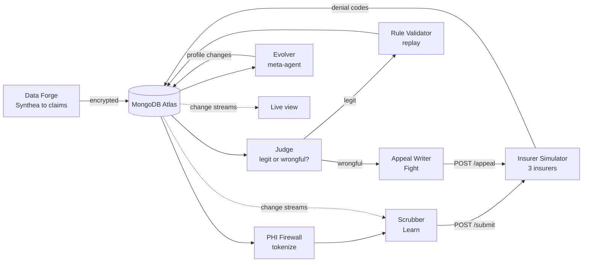

# Claim Cipher: Product Plan (v2)

The full design: what we are building and why. For **who builds what, and how we work in parallel**, see [TEAM_WORKFLOW.md](TEAM_WORKFLOW.md).

- [Pitch and TL;DR](#pitch-and-tldr)
- [The problem](#the-problem)
- [The solution](#the-solution)
- [Architecture](#architecture)
- [The four loops](#the-four-loops)
- [PHI firewall (security layer)](#phi-firewall-security-layer)
- [Insurer simulator spec](#insurer-simulator-spec)
- [Tech stack](#tech-stack)
- [Hackathon resources we use](#hackathon-resources-we-use)
- [MongoDB data model](#mongodb-data-model)
- [Metrics and scoreboard](#metrics-and-scoreboard)
- [Team responsibilities](#team-responsibilities)
- [Demo, booth pitch and video](#demo-booth-pitch-and-video)
- [Risks and fallbacks](#risks-and-fallbacks)
- [Likely judge questions](#likely-judge-questions)
- [Checklists](#checklists)

---

## Pitch and TL;DR

> **"Insurers use algorithms to deny claims. We built a self-improving agent that learns each insurer's hidden behavior, catches wrongful denials, and fights back with evidence-based appeals, without ever showing patient data to the AI."**

The agent does three jobs, in a loop that runs all day:

1. **Learn:** work out each insurer's hidden rules from its denials, so legitimate problems get fixed before the claim is sent.
2. **Judge:** decide whether each denial is legitimate or **wrongful**, meaning it contradicts the insurer's own published policy or looks like an automated bulk denial.
3. **Fight:** draft and file an appeal for wrongful denials, backed by evidence (the policy clause, similar claims the insurer paid, the denial pattern), then learn from which appeals win.

Under all three sits the **PHI firewall**. PHI means protected health information: names, birth dates, member IDs and similar. Patient fields are encrypted in MongoDB with Queryable Encryption, and the LLM only ever sees placeholder tokens.

**Generic engine, health insurance as the first use case.** The core knows nothing about healthcare. It works on any insurance line built from the same pieces: a published policy, a claim, a decision with a reason, and an appeal. Health insurance is the first use case we demo because it has standard denial codes, public code sets and synthetic patient data. Car, home, travel and workers' compensation claims are wrongly denied too; adding a line means a new policy document, a claim schema and a simulator, with no change to the engine. MongoDB's flexible document model means each line's claim schema is stored as-is, with no database migration.

Pitch line for this: *"The engine doesn't know it's healthcare. Any insurance line with a policy, a claim and an appeal can plug in; health is where we started."*

**How it fits the hackathon:**

- **Statement 1 (Recursive Harnessing):** each insurer gets its own harness profile that the agent rewrites: rules, context policy, detection thresholds, appeal strategy, guardrails and tool permissions.
- **Statement 2 (Long Horizon):** it runs from about 1:30 PM to judging against hard scores (acceptance rate, wrongful-denial detection, dollars recovered) and adapts when an insurer changes behavior mid-run.
- **MongoDB is the core:** Queryable Encryption, Vector Search, change streams, time-series collections, aggregation pipelines and database roles all do real work.

---

## The problem

Many claim denials are wrong, and almost nobody fights them.

**How claims work, in 30 seconds:** after treating a patient, the hospital sends the insurer a claim listing diagnosis codes, procedure codes and prices. The insurer's system pays or denies it and returns a standard reason code, such as `CO-50` ("not medically necessary") or `CO-16` ("missing information"). The hospital can appeal a denial, but each appeal takes staff hours.

**Two kinds of denials:**

| Kind | Example | What should happen |
| --- | --- | --- |
| Legitimate | Missing prior-authorization number; two codes billed together that the rules forbid | Fix the claim before sending next time (our **Learn** job) |
| Wrongful | Denied as "not medically necessary" although the insurer's published policy covers it; hundreds of claims denied seconds after submission | Appeal with evidence (our **Judge** and **Fight** jobs) |

**Why wrongful denials matter now** (figures approximate; verify before quoting on stage):

- Insurers increasingly use automated systems to review claims. Lawsuits filed in 2023 against several large US insurers alleged that algorithms denied claims in bulk with little human review.
- Analyses of US marketplace plans have found that patients appeal a tiny fraction of denied claims, often cited as under 1%, even though appeals frequently succeed.
- The cost lands on patients as surprise bills and on clinics as lost revenue and staff time.

**Who uses our tool:** hospital billing departments and revenue-cycle companies (firms that handle billing for hospitals). It is billing operations only. It never makes or questions clinical decisions, and it never changes codes to raise payment.

---

## The solution

One claim's journey through our system shows all three jobs:

1. A claim is created. Patient fields are **encrypted in MongoDB**; the agent works on a tokenized copy (`PATIENT_4821`, age band `40-49`).
2. **Learn:** the scrubber checks the claim against the insurer's active rules and fixes known problems before submission.
3. The claim is sent to the insurer simulator. It comes back paid or denied with a reason code.
4. **Judge:** for a denial, the analyst retrieves the relevant clause from the insurer's published policy and similar past claims, then classifies the denial: *legitimate*, *wrongful (contradicts policy)*, or *wrongful (automated bulk pattern)*.
5. Legitimate denial: the analyst proposes a new prevention rule. It goes live only after passing replay on past claims.
6. **Fight:** wrongful denial: the appeal writer drafts an appeal citing the clause, paid comparable claims and pattern statistics. It is filed with the simulator, which overturns or upholds it.
7. The outcome feeds back: appeal wins and losses teach the harness which evidence works for each insurer.

### What the harness rewrites about itself

Each insurer has a **harness profile** in MongoDB. The meta-agent (the Evolver) changes it based on results, and change streams push every change into the running agents without a restart.

| Part of the profile | Example of it evolving |
| --- | --- |
| Prevention rules | "Payer A: always attach prior-auth ID for code G0439" |
| Context policy | For payer B, include the 5 most similar paid claims in the Judge prompt, because comparables win appeals there |
| Detection thresholds | Flag "automated bulk denial" for payer B when 20 or more identical denials arrive within 60 seconds |
| Appeal strategy | Payer C overturns more often when the policy clause is quoted word for word, so lead with it |
| Tool permissions (Trust Ladder) | Starts at *draft-only*; earns *auto-file appeals* for an insurer after 10 appeals in a row with correct wrongful calls |
| Guardrails | Learned: "never send the free-text notes field to the LLM". Fixed, never changeable: no upcoding, no PHI to the LLM |

### What the user sees

A live view (supporting the agent, not the main feature) with four panels: the claim stream, rules and profile changes going live, open appeals and their outcomes, and the scoreboard.

---

## Architecture

Nine components; each has one owner, and they communicate only through MongoDB collections and two HTTP endpoints on the simulator.



| # | Component | Input | Output | LLM | Owner |
| --- | --- | --- | --- | --- | --- |
| 1 | Data Forge | Synthea CSVs | ~2,000 claims in `claims`, patient fields encrypted | None | A |
| 2 | Insurer Simulator | Claim or appeal via HTTP | Paid or denied + CARC/RARC codes + timestamp; appeal overturned or upheld | None (deterministic) | A |
| 3 | PHI Firewall | Claim with encrypted fields | Tokenized claim for the LLM; leak-checked LLM input and output | None | B |
| 4 | Scrubber | Tokenized claim + active rules for that insurer | Fixed claim, submitted | Haiku 4.5 | C |
| 5 | Judge | Denial + policy clauses (Vector Search) + similar claims | Verdict: legitimate / wrongful-policy / wrongful-bulk, with confidence and evidence ids | Sonnet 5 | C |
| 6 | Rule Validator | Candidate rule | Replay stats; promote, reject or retire | None (aggregation pipeline) | B |
| 7 | Appeal Writer | Wrongful verdict + evidence | Appeal letter (tokenized), filed | Sonnet 5 | C |
| 8 | Evolver | Metrics, appeal outcomes, verdict accuracy, events | Changes to `harness_profiles` with a reason | Sonnet 5 | C |
| 9 | Live view | Change streams via Server-Sent Events | Four panels in the browser | None | D |

**Orchestrator:** one async Python process runs components 3 to 8 as workers, streaming about 2 claims per second (adjustable) so we control LLM cost.

**Why the simulator uses no LLM:** the score must be trustworthy and repeatable. Ground-truth labels (which denials we planted as wrongful) live in a collection the agents cannot read; see the data model.

---

## The four loops

The agent never sees the ground truth. It learns only from signals a real billing team would have: denial codes, the published policy, and appeal outcomes.

### Loop 1: Learn (prevent legitimate denials)

1. Judge labels a denial *legitimate*.
2. Vector Search groups it with similar legitimate denials for the same insurer.
3. When a group reaches 3 or more denials, the Judge proposes a **candidate rule** (condition + fix + evidence ids).
4. The Validator replays it (below). If promoted, the scrubber applies it to the next claims.

### Loop 2: Judge (legitimate or wrongful?)

For each denial the Judge gets, through the PHI firewall:

- the tokenized claim and the denial code;
- the top 3 matching clauses from the insurer's published policy (Vector Search on `policies`);
- up to 5 similar claims from the same insurer and whether they were paid;
- bulk-pattern signals computed by an aggregation: identical denials in the last 60 seconds, time from submission to denial.

It returns a verdict, a confidence score and the evidence ids. Anything below the insurer's confidence threshold is marked *needs human review* and skipped.

### Loop 3: Fight (appeal)

1. The Appeal Writer drafts a letter from the evidence, following the insurer's current appeal strategy.
2. Before filing, the PHI firewall checks the draft; detokenization happens only in the final rendered letter, outside the LLM.
3. Draft-only mode: the appeal waits for a human click in the live view. Auto-file mode: it is filed immediately.
4. The simulator answers overturned or upheld. **Overturned confirms the Judge was right**; this is the agent's main learning signal.

### Loop 4: Evolve (the harness rewrites itself)

The Evolver runs every 5 minutes, or after every 50 new outcomes:

1. Reads recent metrics for each insurer: acceptance, appeal win rate, verdicts later contradicted by appeal outcomes.
2. Proposes **at most one profile change per insurer per cycle**, with a written reason.
3. The change is logged in `harness_events` and pushed live through change streams.
4. **Automatic rollback:** if the target metric gets worse over the next cycle, the change is reverted and logged as reverted.

### Rule lifecycle

| State | Meaning | Moves on when |
| --- | --- | --- |
| Candidate | Proposed with evidence | Replay runs automatically |
| Shadow | Replayed on all past claims for that insurer | Prevents 3 or more past denials and would block 5% or fewer of past paid claims → Active; otherwise Rejected |
| Active | Applied by the scrubber, pushed by change stream | Precision below 80% over its last 20 uses, or no use in 30 minutes → Retired |
| Retired | Kept for history and the audit log | Never deleted |

The Judge's thresholds follow the same idea: the Evolver may only change them if a replay over past verdicts with known appeal outcomes shows an improvement.

---

## PHI firewall (security layer)

The rule is simple: **no real patient identifier ever reaches the LLM**, and the database never stores one unencrypted.

### 1. Encryption at rest and in use: MongoDB Queryable Encryption

- **Encrypted fields in `claims`:** `patient.name`, `patient.dob`, `patient.member_id`, `patient.ssn`, `patient.address`, `patient.phone`, `notes`.
- **Queryable:** `patient.member_id` with equality queries (to find a patient's other claims). The rest are encrypted without query support.
- **Setup:** `pymongo[encryption]`, the `crypt_shared` library matching the cluster's MongoDB version, a local key provider (a 96-byte key file) for the hackathon, and the key vault collection `encryption.__keyVault`. In production this would be a cloud key management service (AWS, Azure or GCP).
- **Key separation:** only the PHI firewall process holds the key file. The agent workers connect with a database user that can read claims but gets only ciphertext for these fields.
- **Timebox: 60 minutes.** If Queryable Encryption doesn't work on the sandbox cluster, fall back to Client-Side Field Level Encryption (also MongoDB, explicit mode). Check the cluster version first thing (Queryable Encryption needs 7.0 or later).

### 2. Tokenization before the LLM

| Real field | What the LLM sees |
| --- | --- |
| Name, member ID | `PATIENT_4821` (random token, mapped in the encrypted `phi_tokens` collection) |
| Date of birth | Age band: `40-49` |
| Service dates | Relative days: `day 0`, `day 12` |
| Address | State only |
| Free-text notes | Removed by default; a redacted version only if the insurer profile allows it |
| Diagnosis and procedure codes, amounts, insurer | Unchanged (needed for billing, not identifying on their own) |

The real values are put back only when the final appeal letter is rendered, in plain code, after all LLM calls are finished.

### 3. Leak detector (the part that evolves)

Every LLM request and response passes through it:

- Pattern checks: SSN, phone, email, date formats, member-ID formats.
- Exact-match check against this patient's real values (decrypted in memory inside the firewall only).
- On a hit: **block the call**, log a `phi_incidents` document, and the Evolver proposes a new guardrail, such as a stricter redaction pattern or dropping a field for that insurer.

**Red-team test built into the data:** the Data Forge plants realistic PHI in the free-text notes of about 5% of claims (for example "pt called back, DOB 04/12/1961, cell 555-..."). The scoreboard shows **leaks blocked** and **PHI reaching the LLM: 0**.

---

## Insurer simulator spec

The simulator is a deterministic FastAPI service with three fictional insurers, each with a different personality. It is the only place the hidden rules exist.

### Codes and data

- Synthea supplies patients and encounters (demographics, visit dates, visit types).
- We map encounters to our own small code set of about 40 codes: **ICD-10-CM** diagnosis codes and **HCPCS Level II** procedure codes, both public. No CPT codes (AMA licensed).
- Hidden rules are modeled on real rule types insurers use: prior authorization, code pairs that can't be billed together (NCCI-style edits), maximum units per day, filing deadlines, duplicate claims, missing modifiers.

### The three insurers

| Insurer | Personality | Hidden legitimate rules | Planted wrongful behavior |
| --- | --- | --- | --- |
| Payer A | Strict but fair | 8 | 1: denies a service its policy covers (clause 7) as `CO-50` in about 10% of cases |
| Payer B | Algorithmic denier | 6 | 3: auto-denies imaging claims over $2,000 as `CO-50` within 2 seconds, in batches; denies covered follow-up visits; sometimes returns the wrong reason code |
| Payer C | Policy drifter | 7 | 1, plus the **policy-change button**: 3 hidden rules swap and the published policy gets a new version |

Each insurer has a **published policy** of about 12 numbered clauses (`sim/policies/payer_a.md` and so on). The agents can read these through the `policies` collection; they can never read the hidden rules.

**Target starting mix:** about 35% of claims denied at cold start, of which roughly 60% legitimate (fixable) and 40% wrongful. Tune on Saturday so the demo curve is visible.

### Appeal logic (learnable, different per insurer)

- A **legitimate** denial that is appealed is always **upheld**. This punishes a Judge that calls everything wrongful.
- A **wrongful** denial is **overturned** only if the appeal contains the right evidence:
    - Payer A: cites the correct clause number.
    - Payer B: includes 2 or more paid comparable claims **and** the bulk-denial pattern statistics.
    - Payer C: quotes the clause word for word from the **current** policy version.

This is what the Evolver learns as each insurer's appeal strategy.

### Endpoints

| Endpoint | Request | Response |
| --- | --- | --- |
| `POST /submit` | Tokenized claim JSON | `{claim_id, status, carc, rarc, paid_amount, adjudicated_at, latency_ms}` |
| `POST /appeal` | `{claim_id, letter, cited_clause_ids, comparable_claim_ids, pattern_stats}` | `{appeal_id, outcome: overturned or upheld, paid_amount}` |
| `POST /admin/policy-change/{payer}` | none | New policy version id |
| `GET /health` | none | ok |

Every adjudication also writes a ground-truth label to `sim_truth` (legitimate or wrongful, and which rule fired). Only the scorer can read it.

---

## Tech stack

One language (Python) for everything except a thin web view, so all four of us can work in any part of the code.

| Layer | Choice | Why |
| --- | --- | --- |
| Database | **MongoDB Atlas** (hackathon sandbox cluster) | Required for finalists; Queryable Encryption, Vector Search, change streams, time-series collections and database roles in one place |
| Encryption | MongoDB Queryable Encryption via `pymongo[encryption]` + `crypt_shared`, local key provider | Patient data is never stored or queried in plain text. Fallback: Client-Side Field Level Encryption (explicit mode) |
| Backend | Python 3.12, FastAPI, `pymongo` (async), asyncio workers | Fast to write, good Atlas driver support |
| LLM | Claude models through OpenRouter (free hackathon credits at 10:30 AM): Sonnet 5 for the Judge, Appeal Writer and Evolver; Haiku 4.5 for the scrubber | Strong reasoning where rules are inferred, cheap where volume is high. Swappable if we get other credits |
| Embeddings | MongoDB Automated Embeddings (Atlas creates them for the Vector Search index). Fallback: MongoDB Embedding and Reranking API | Embeds denials and policy clauses for Vector Search (denial clustering and clause retrieval) |
| Insurer simulator | FastAPI service with a plain Python rules engine (no LLM) | Must be deterministic so the score is trustworthy |
| Data | [Synthea](https://github.com/synthetichealth/synthea) synthetic patients and encounters; ICD-10-CM and HCPCS Level II codes; NCCI-style edit types; CARC/RARC denial codes | All public. No real patient data |
| Live view | Next.js or plain HTML + JS on Vercel, fed by Server-Sent Events from a change stream; Python backend on a laptop behind a tunnel | Shows rules going live and the score moving. **Not Streamlit** (banned) |
| Repo | Public GitHub repo from the first commit | Required; commit history proves the work was done at the event |
| Dev tooling | MongoDB MCP Server + Agent Skills in our AI coding assistant; Codex or Kiro credits | The assistant can inspect our real collections and write aggregation pipelines. Speeds up building; not part of the product |
| Tracing | LangSmith ($50 hackathon credits) | Debug Judge, Appeal Writer and Evolver calls; show a trace if a judge asks how a decision was made |

**Licensing note:** CPT procedure codes are owned by the AMA. We use HCPCS Level II and ICD-10 (public) or synthetic procedure codes, never CPT.

---

## Hackathon resources we use

From the official resource guide (open the guide for the links). Hacking starts at 10:30 AM, so the night before is sign-ups and reading only.

| Resource | What we use it for | Owner | When |
| --- | --- | --- | --- |
| MongoDB Automated Embeddings | Embeddings for `adjudications` and `policies` without our own embedding code | B | Turn on 10:30 - 11:00; check the sandbox supports it |
| MongoDB Embedding and Reranking API | Fallback for embeddings; reranking to improve policy-clause retrieval (extra, if time allows) | B | Only if needed |
| MongoDB MCP Server + Agent Skills | Connect our coding assistant to the sandbox cluster for faster pipeline and query work | B (everyone may use it) | Set up the night before |
| OpenRouter credits | LLM budget; one key for Claude and other models | C | Arrives 10:30 AM; backup key until then |
| LangSmith ($50) | Tracing agent calls | C | Redeem the night before (card required, not charged; redeem within 10 days) |
| Vercel | Hosts the live view so we have an accessible demo link | D | Decide hosting by 3:30 PM |
| Codex or Kiro credits | AI coding assistant, team's choice | Everyone | The night before |
| "State & Persistence: The Problem of Agent Reliability", "Build an AI Agent with LangGraph and MongoDB Atlas" | Background for the long-horizon story and Q&A answers | C | Read the night before |
| GenAI Showcase, MongoDB Python Quickstart | Code patterns for Vector Search and change streams | B | Read the night before; write our own code |

**Skipping:** ElevenLabs (voice doesn't fit the story), LangGraph as the agent framework (only if Role C already knows it), and copying starter code wholesale. If we reuse official boilerplate, the README says so, to keep what we built at the event clear.

**From the guide's requirements:** a public repo **and an accessible demo** are required, and the demo video must be **recorded on-site on Saturday**.

---

## MongoDB data model

Twelve collections in one database, `denialfighter`. Role B creates all of them in the first hour; everyone else codes against the shapes below.

| Collection | Holds | Written by | Atlas feature |
| --- | --- | --- | --- |
| `claims` | Claims with nested line items; patient fields encrypted | Data Forge | **Queryable Encryption** |
| `phi_tokens` | Token to encrypted patient reference | PHI firewall | Queryable Encryption |
| `phi_incidents` | Blocked leaks: where, pattern, action taken | PHI firewall | Audit trail |
| `policies` | Published policy clauses per insurer and version | Data Forge | **Vector Search** (clause retrieval) |
| `adjudications` | Each submission: status, codes, timing, denial text, Judge verdict | Orchestrator | **Vector Search** (denial clustering) |
| `rules` | Prevention rules with lifecycle status, evidence, replay stats | Judge, Validator | Aggregation pipelines (replay) |
| `appeals` | Appeal letters (tokenized), evidence, outcome | Appeal Writer | Document model |
| `harness_profiles` | One per insurer: context policy, thresholds, appeal strategy, permissions, guardrails | Evolver | **Change streams** (hot reload) |
| `harness_events` | Every change to rules, profiles, permissions: before, after, reason, reverted? | All | Audit log |
| `metrics` | Acceptance, verdict accuracy, appeal win rate, dollars recovered, leaks blocked, tokens | Scorer | **Time-series collection** |
| `sim_truth` | Ground truth per adjudication | Simulator | **Database roles**: agents cannot read it |
| `encryption.__keyVault` | Encryption data keys | Setup script | Queryable Encryption |

### Example: `harness_profiles`

```json
{
  "_id": "payer_b",
  "version": 14,
  "context_policy": {"policy_clauses": 3, "paid_comparables": 5, "include_pattern_stats": true},
  "judge": {"min_confidence": 0.75, "bulk_window_sec": 60, "bulk_min_identical": 20},
  "appeal_strategy": {"lead_with": "paid_comparables", "include_pattern_stats": true},
  "permissions": {"appeals": "auto_file", "earned_at": "2026-09-26T15:12:00Z"},
  "guardrails": {
    "fixed": ["no_upcoding", "no_phi_to_llm"],
    "learned": ["drop_notes_field"]
  },
  "updated_by": "evolver",
  "last_event_id": "evt_0931"
}
```

### Example: `appeals`

```json
{
  "_id": "apl_2217",
  "claim_id": "clm_88412",
  "insurer": "payer_b",
  "verdict": "wrongful_bulk",
  "confidence": 0.86,
  "evidence": {
    "clause_ids": ["payer_b_v1_c7"],
    "comparable_claim_ids": ["clm_80211", "clm_80977"],
    "pattern_stats": {"identical_denials_60s": 43, "median_latency_ms": 1180}
  },
  "letter_tokenized": "Re: claim for PATIENT_4821 ...",
  "mode": "auto_file",
  "outcome": "overturned",
  "recovered_usd": 2340
}
```

### Indexes and roles (Role B, first hour)

- Vector Search index on `adjudications.denial_text` (Automated Embeddings), filtered by `insurer`.
- Vector Search index on `policies.clause_text` (Automated Embeddings), filtered by `insurer` and `version`.
- Compound indexes: `rules {insurer, status}`, `adjudications {insurer, adjudicated_at}`, `appeals {insurer, outcome}`.
- `metrics` created as a time-series collection (`timeField: ts`, `metaField: insurer`).
- Database users: `agent_worker` (app collections, no `sim_truth`, no key vault), `firewall` (adds key vault), `simulator` (writes `sim_truth`), `scorer` (reads `sim_truth`). Check on the day that the sandbox tier allows custom roles; if not, enforce it in code and say so.

---

## Metrics and scoreboard

The scorer writes these to `metrics` every 30 seconds, per insurer. It is the only code that reads `sim_truth`, so the numbers are honest.

| Metric | Definition | Demo target |
| --- | --- | --- |
| First-pass acceptance | Share of held-out claims paid on first submission | About 65% at cold start to about 90% |
| Judge precision (wrongful) | Of denials the Judge called wrongful, share that really were | 85% or higher |
| Judge recall (wrongful) | Of truly wrongful denials, share the Judge caught | 70% or higher |
| Appeal win rate | Appeals overturned / appeals filed | Rises as the Evolver learns each insurer's strategy |
| Dollars recovered | Sum of `recovered_usd` from overturned appeals | Headline number for the demo |
| PHI reaching the LLM | Planted identifiers found in any stored LLM output (verdicts, events, rules, tokenized appeal letters). Requests aren't stored; the leak detector blocks them before the call | **0**, always |
| Leaks blocked | Calls stopped by the leak detector | Grows during the day |
| Cost per claim | LLM tokens and dollars per processed claim | Shown to answer "is this affordable?" |

**Held-out claims:** 20% of claims are tagged `holdout: true`. Their outcomes are scored but never used to learn rules or tune the harness, which proves the learning generalizes.

**Baseline run:** as soon as the end-to-end loop works (target 1:00 PM), run the pipeline with the Judge and Evolver switched off and record the numbers. That is the "before" in the demo.

---

## Team responsibilities

Each member is responsible for their deliverables **and for the specs other people code against**. The specs below are drafts. Confirm them at the 10:30 AM whiteboard session, then they are frozen at 11:00. After that, only the owner changes a spec, and only after telling the team.

Folders, branches, the contracts table and the git workflow are in [TEAM_WORKFLOW.md](TEAM_WORKFLOW.md#how-we-work-in-parallel).

### Member A: Simulation and scoring

**Mission:** a believable, deterministic insurer world, and an honest scoreboard. **Owns:** `forge/`, `sim/`, `scorer/`.

**First 30 minutes (10:30 - 11:00):** whiteboard session for the models (15 min), then start loading Synthea data into claims.

**Deliverables:**

| By | Deliverable |
| --- | --- |
| 11:15 | Stub `/submit` and `/appeal` on port 8001, returning random but valid responses |
| 12:00 | Real `/submit`: hidden rules for 3 insurers, planted wrongful behavior, Payer B batch timing; about 2,000 claims loaded |
| 1:00 | Real `/appeal` with per-insurer logic; `sim_truth` written on every decision; policies loaded into `policies` |
| 2:30 | Scorer writing real metrics every 30 s; policy-change endpoint for Payer C |
| 3:30 | PHI planted in about 5% of notes; 20% of claims `holdout: true`; mix tuned (about 65% cold-start acceptance) |

**Specs A owns:**

*Hidden rule format (in `sim/rules/payer_x.py`, never imported by agents).* Each insurer has an ordered list of rules; the first match decides:

| Field | Meaning |
| --- | --- |
| `id` | For example `b_legit_03` or `b_wrong_01` |
| `kind` | `legit` or `wrongful` |
| `applies(claim) -> bool` | Python function over the claim |
| `probability` | 0 to 1; for probabilistic behavior (Payer A denies clause-7 services about 10% of the time) |
| `carc`, `rarc` | Denial codes returned |
| `contradicts_clause` | For wrongful rules: the clause id the denial violates (used by the appeal logic) |

No match means paid. Payer B's bulk rules answer in under 2 seconds and group denials into 2-second batches: every denial in a batch shares one `adjudicated_at` timestamp and `batch_id`.

*Policy clause document (collection `policies`):* `{_id: "payer_b_v1_c7", insurer, version, clause_no, title, clause_text, current: true}`. Payer C's policy change writes version 2 and sets `current: false` on version 1.

*`sim_truth` document:* `{adjudication_id, claim_id, insurer, kind: legit|wrongful, rule_id}`.

*Metrics document (time-series `metrics`):* `{ts, insurer, acceptance_rate, judge_precision, judge_recall, appeal_win_rate, recovered_usd, phi_leaks_to_llm, leaks_blocked, cost_usd_per_claim}`, computed on held-out claims.

**Done when:** C's agents can't tell the stub from the real simulator except by the results, and the scorer's numbers match a manual check of 10 claims.

### Member B: MongoDB and security

**Mission:** the foundation everyone imports, and the guarantee that no patient data reaches the LLM. **Owns:** `common/`, `firewall/`, `validator/`, `scripts/setup_db.py`.

**First 30 minutes (10:30 - 11:00):** create the repo skeleton, `pyproject.toml`, `.env.example`, `common/db.py`; run the models whiteboard session and commit `common/models.py`; check that everyone connects to Atlas.

**Deliverables:**

| By | Deliverable |
| --- | --- |
| 11:00 | `common/models.py` frozen; everyone connected |
| 11:30 | `setup_db.py` (collections, indexes, time-series, Vector Search with Automated Embeddings); stubs for search, tokenize, guard, render_letter, replay, profiles.watch; `common/rules.py` |
| 12:00 | Queryable Encryption working, or fallback to Client-Side Field Level Encryption chosen |
| 12:30 | Real tokenize, guard (leak detector) and search; `common/llm.py` via OpenRouter with LangSmith tracing |
| 2:30 | Real `validator.replay` (aggregation pipelines) and `profiles.watch` (change streams) |
| 3:30 | Evolving leak detector (reads guardrails from the profile, logs `phi_incidents`); database roles if the sandbox allows |

**Specs B owns:**

*Environment variables (`.env.example`):* `MONGODB_URI`, `MONGODB_DB=denialfighter`, `OPENROUTER_API_KEY`, `LANGSMITH_API_KEY`, `LANGSMITH_PROJECT`, `QE_KEY_FILE`, `CRYPT_SHARED_PATH`, `SIM_URL=http://localhost:8001`, `WEB_API_URL=http://localhost:8002`, `CLAIM_RATE_PER_SEC=2`.

*Model fields (`common/models.py`):*

| Model | Fields |
| --- | --- |
| `Claim` | `_id` (`clm_00001`), `insurer` (`payer_a`/`payer_b`/`payer_c`), `patient {name, dob, member_id, ssn, address, phone}` (encrypted), `service_date`, `encounter_type`, `diagnosis_codes[]` (ICD-10-CM), `lines[] {line_no, hcpcs, modifiers[], units, charge_usd}`, `total_charge_usd`, `prior_auth_id` (optional), `referring_provider_id` (optional), `records {prior_auth_id, referring_provider_id}` (what the hospital has on file; fixes copy from here), `notes` (encrypted), `holdout`, `created_at` |
| `TokenizedClaim` | Same as `Claim` but `patient` replaced by `patient_token`, `age_band`, `state`; `service_date` replaced by `service_day`; `notes` removed or redacted |
| `Adjudication` | `_id`, `claim_id`, `insurer`, `attempt` (1 = first pass), `status` (`paid`/`denied`), `carc`, `rarc`, `denial_text` (embedded), `paid_amount_usd`, `submitted_at`, `adjudicated_at`, `latency_ms`, `verdict` (Verdict or null), `holdout` |
| `Rule` | `_id`, `insurer`, `version`, `status` (`candidate`/`shadow`/`active`/`retired`/`rejected`), `condition`, `fix`, `evidence_ids[]`, `replay {prevented, false_blocks, precision}`, `hit_count`, `parent_version`, `created_by`, `created_at` |
| `ReplayStats` | `prevented`, `false_blocks`, `precision`, `sample_size`, `decision` (`promote`/`reject`/`retire`) |
| `Appeal` | As in the example document in the data model |
| `HarnessProfile` | As in the example document in the data model |

*Rule format (`common/rules.py`, used by C's scrubber and B's validator).* A rule must be machine-checkable, never free text:

```json
{
  "condition": {"all": [
    {"field": "lines.hcpcs", "op": "eq", "value": "G0439"},
    {"field": "prior_auth_id", "op": "missing"}
  ]},
  "fix": {"action": "attach_prior_auth"}
}
```

- **Allowed fields:** `diagnosis_codes`, `lines.hcpcs`, `lines.modifiers`, `lines.units`, `total_charge_usd`, `prior_auth_id`, `referring_provider_id`, `encounter_type`.
- **Allowed ops:** `eq`, `ne`, `in`, `gt`, `lt`, `missing`, `present`, `contains`.
- **Allowed fix actions:** `attach_prior_auth`, `attach_referring_provider`, `add_modifier {modifier}`, `split_units {max_units}`, `drop_line {hcpcs}` (for codes that can't be billed together), `hold_for_review`.
- `common/rules.py` provides `matches(rule, claim) -> bool`, `to_match(rule) -> dict` (MongoDB `$match` for replay), and `apply_fix(rule, claim) -> claim`. **`apply_fix` refuses any change to diagnosis codes or charges** (the no-upcoding guardrail lives here).

*PHI incident document:* `{ts, insurer, claim_id, direction: request|response, pattern, action: blocked, guardrail_proposed}`.

**Done when:** a claim goes in encrypted, comes out tokenized, and a planted SSN in the notes is blocked before any LLM call.

### Member C: Agents

**Mission:** the agent loop that learns, judges, fights and rewrites its own harness. **Owns:** `agents/`, `orchestrator/`, `scripts/smoke.py`.

**First 30 minutes (10:30 - 11:00):** whiteboard session for the models, then the orchestrator skeleton and first prompt drafts in `agents/prompts/`.

**Deliverables:**

| By | Deliverable |
| --- | --- |
| 11:30 | Orchestrator running end to end on stubs; stubs for `judge.classify`, `appeal_writer.draft`, `evolver.run_cycle` |
| 12:30 | Scrubber (Haiku) applying active rules; Judge (Sonnet) returning real verdicts; `scripts/smoke.py` |
| 1:00 | Appeal Writer (Sonnet); **real end-to-end loop**; baseline run started |
| 2:30 | Rule proposals from denial clusters, sent to `validator.replay`; rule lifecycle |
| 3:30 | Evolver with bounds and automatic rollback; Trust Ladder |

**Specs C owns:**

*Verdict (the Judge's JSON output, stored in `adjudications.verdict`, shown in D's "Why?" drawer):*

```json
{
  "label": "wrongful_bulk",
  "confidence": 0.86,
  "reason": "Clause 7 covers this imaging code; 43 identical denials in 60 s.",
  "evidence": {
    "clause_ids": ["payer_b_v1_c7"],
    "comparable_claim_ids": ["clm_80211", "clm_80977"],
    "pattern_stats": {"identical_denials_60s": 43, "median_latency_ms": 1180}
  },
  "suggested_rule": null,
  "model": "sonnet-5",
  "created_at": "2026-09-26T14:02:11Z"
}
```

`label` is one of `legitimate`, `wrongful_policy`, `wrongful_bulk`, `needs_review`. For `legitimate`, `suggested_rule` may hold a candidate rule in B's rule format.

*Event document (`harness_events`, the source for D's harness-changes panel):* `{_id, ts, insurer, actor: evolver|judge|validator|firewall|human, type, before, after, reason, evidence_ids[], reverted}`. `type` is one of `rule_proposed`, `rule_promoted`, `rule_rejected`, `rule_retired`, `profile_changed`, `permission_changed`, `guardrail_added`, `rollback`, `phi_blocked`.

*What the Evolver may change, and the limits (one field per insurer per cycle):*

| Profile field | Allowed values |
| --- | --- |
| `context_policy.policy_clauses` | 1 to 5 |
| `context_policy.paid_comparables` | 0 to 8 |
| `context_policy.include_pattern_stats` | true / false |
| `judge.min_confidence` | 0.50 to 0.95 |
| `judge.bulk_window_sec` | 30 to 300 |
| `judge.bulk_min_identical` | 5 to 100 |
| `appeal_strategy.lead_with` | `clause`, `paid_comparables`, `pattern_stats` |
| `appeal_strategy.quote_clause_verbatim` | true / false |
| `guardrails.learned` | Add from B's fixed list only (for example `drop_notes_field`, `redact_notes_strict`) |
| `permissions` | **Never directly.** Only the Trust Ladder changes it: auto-file after 10 correct wrongful calls in a row for that insurer; back to draft-only after 2 upheld appeals in a row |
| `guardrails.fixed` | **Never** |

*Prompts:* one file per agent in `agents/prompts/` (`scrubber.md`, `judge.md`, `appeal_writer.md`, `evolver.md`), each ending with the exact JSON output format.

**Done when:** `scripts/smoke.py` passes on `main`, and a profile change made by the Evolver shows up in `harness_events` with a reason.

### Member D: Demo and product

**Mission:** make the agent's work visible, and ship the demo and submission. **Owns:** `web/`, `scripts/seed_fake.py`, `scripts/reset_demo.py`, `README.md`.

**First 30 minutes (10:30 - 11:00):** whiteboard session for the models, then `scripts/seed_fake.py` so everyone has data to code against by 11:00.

**Deliverables:**

| By | Deliverable |
| --- | --- |
| 11:00 | `seed_fake.py`: about 50 fake claims, adjudications, appeals, events and metrics |
| 12:00 | `web/api.py` (FastAPI on port 8002) with an SSE endpoint; claim stream panel |
| 1:00 | Scoreboard panel on real metrics |
| 2:30 | Harness-changes panel |
| 3:30 | Appeals panel with approve button; "Why?" drawer; policy-change and reset buttons |
| 4:15 | `reset_demo.py`; live view on Vercel; backup video recorded |
| 4:45 | README "What we built at the event"; 1-minute video recorded on-site; submission done |

**Specs D owns:**

*Web stack (decided):* plain HTML + JS in `web/static/` (no build step), deployed to Vercel with the backend URL as a setting. `web/api.py` runs on the laptop behind a tunnel and serves SSE and the button endpoints.

*Where each panel gets its data:*

| Panel | Source |
| --- | --- |
| Claim stream | Change stream on `adjudications` |
| Harness changes | Change stream on `harness_events` |
| Appeals | Change stream on `appeals` |
| Scoreboard | Latest `metrics` per insurer, every 5 s |
| "Why?" drawer | `GET /events/{id}` and `GET /adjudications/{id}` (returns the Verdict and its evidence) |

*Button endpoints on `web/api.py`:* `POST /appeals/{id}/approve` (sets the appeal to approved; the orchestrator files it), `POST /demo/policy-change` (calls the simulator's `/admin/policy-change/payer_c`), `POST /demo/reset` (runs `reset_demo.py`).

**Done when:** a teammate who didn't build it can run the 3-minute demo script from the live view alone.

---

## Demo, booth pitch and video

Show the system working, never slides. The long run from 1:30 PM means the history on screen is real.

### 3-minute live demo

| Time | Say | Show |
| --- | --- | --- |
| 0:00 | "Insurers use algorithms to deny claims, and almost nobody appeals. We built an agent that learns each insurer, catches wrongful denials, and fights back. Billing operations only, never medical advice." | Live view, claims flowing |
| 0:25 | "Here's a Payer B denial: 'not medically necessary', 1.2 seconds after submission, 43 identical denials in the last minute." | Click a denial: Judge verdict *wrongful (bulk)*, the policy clause that covers it, paid comparable claims |
| 0:55 | "The agent wrote this appeal from that evidence, and the insurer just overturned it." | Appeal panel: letter (tokenized), outcome, dollars recovered |
| 1:20 | "It also rewrites its own harness. For Payer B it learned that paid comparables win appeals, so it changed its own context policy. Pushed live through a MongoDB change stream, no restart." | Harness-changes panel; open the "Why?" drawer on that event |
| 1:50 | "Payer C just changed its policy." | Press the button: acceptance dips, stale rules retire, new clause picked up, recovery |
| 2:20 | "And the AI never saw a single patient identifier. Fields are encrypted with Queryable Encryption, and this detector blocked every leak we planted." | Atlas view of an encrypted document; "PHI reaching the LLM: 0" and leaks blocked |
| 2:45 | "Since 1:30 today: acceptance from X% to Y% on held-out claims, $Z recovered." | Scoreboard. Use the real numbers |

**Before going on:** run `reset_demo.py` only if the live state is broken; otherwise show the real long-run state. Keep the backup video open in another tab.

### Booth pitch for Sept 30 (10 seconds)

"Insurance algorithms deny claims in seconds. Our AI learns each insurer's behavior and appeals the wrongful ones with evidence, and it never sees patient data."

### 1-minute submission video (recorded on-site)

1. 0:00 - 0:10: the problem in one sentence over the live view.
2. 0:10 - 0:30: a wrongful denial caught and an appeal overturned.
3. 0:30 - 0:45: a harness profile change going live, with its reason.
4. 0:45 - 0:55: encrypted document in Atlas and the "PHI reaching the LLM: 0" counter.
5. 0:55 - 1:00: scoreboard, repo link, and "everything shown was built today".

---

## Risks and fallbacks

| Risk | Early warning | Fallback |
| --- | --- | --- |
| End-to-end loop not working by 1:00 PM | 12:00 checkpoint missed | Everyone stops feature work and helps wire the loop with stubs; cut from the cut list |
| Queryable Encryption fails on the sandbox | Not working by 12:00 | Client-Side Field Level Encryption; tokenization and leak detector unchanged |
| Custom database roles not allowed on the sandbox tier | Setup error at 10:30 | Enforce `sim_truth` access in code; say so honestly if asked |
| LLM cost or rate limits | Spend or 429 errors in the first hour | Lower the claim rate; Haiku for more steps; cache the policy and system prompt; batch Judge calls |
| Judge calls everything wrongful | Precision under 70% at 2:30 | Raise `min_confidence`; add 5 labeled examples to the prompt; the simulator already punishes bad appeals |
| Curve is flat, nothing visibly improves | Metrics flat by 3:00 | Tune the simulator mix (more learnable rules), shorten the Evolver cycle to 2 minutes |
| Judges think it's "basic RAG" or "a dashboard" | Question in Q&A | Point to the loops: replay validation, self-rewriting profiles with rollback, encryption; the live view only displays them |
| Judges hear "healthcare" and think medical advice | First 10 seconds | Say "billing operations only" in the first sentence |
| Live demo breaks on stage | Anything odd during rehearsal | Backup video recorded by 4:15; `reset_demo.py` restores a known state |
| Wi-Fi fails | Venue Wi-Fi slow | Phone hotspot; Atlas and the LLM API are the only outside calls |
| OpenRouter credits late or too small | No credits by 10:45 AM, or balance draining fast | Use the backup key; lower the claim rate; move more steps to Haiku |
| Automated Embeddings not available on the sandbox | Index creation fails at 10:30 | MongoDB Embedding and Reranking API with a small `search.py` wrapper |
| Live view on Vercel can't reach the backend | Tunnel drops during rehearsal | Demo from localhost on the laptop; keep the Vercel link for the submission |

---

## Likely judge questions

Each answer fits in about 20 seconds. The owner of that part answers.

### Is it real?

**"You built the insurer and planted the wrongful denials. Isn't it circular?"** (A)
The agents never see the hidden rules or the ground truth; database roles block it. They learn only from what a billing team gets: denial codes, the published policy and appeal outcomes. We score on held-out claims.

**"Would this work with real insurers?"** (A)
The inputs are real formats: standard CARC/RARC denial codes, which come back in the X12 835 remittance file, and published policy documents. Production swaps our simulator for a clearinghouse feed. We used synthetic data because real patient data isn't allowed here.

**"How do you know a denial is wrongful without ground truth?"** (C)
Two signals: it contradicts the insurer's own published clause, or it matches a bulk pattern such as identical denials seconds after submission. Appeal outcomes then confirm or correct the Judge, and the Evolver tunes its thresholds from that.

### Technical depth

**"Isn't this RAG plus a letter generator?"** (C)
Retrieval is one input. The system proposes rules and proves them by replay, rewrites its own per-insurer harness with automatic rollback, learns appeal strategies from outcomes, and enforces a PHI firewall on every LLM call.

**"What exactly does the harness change about itself?"** (C)
Per insurer: prevention rules, what goes into context, detection thresholds, appeal strategy, guardrails and tool permissions. Every change has a reason and is logged, and changes that make results worse are rolled back.

**"What's long-horizon about it?"** (C)
It has run since 1:30 PM. All memory lives in MongoDB, not in the context window, so it can keep running and improving for weeks, and it adapts when an insurer changes behavior.

### MongoDB

**"Why MongoDB?"** (B)
One database gives us Queryable Encryption for patient data, Vector Search with Automated Embeddings for clauses and denials, change streams for live harness updates, time-series metrics and role-based isolation of the ground truth.

**"What breaks without MongoDB?"** (B)
No encrypted patient data, no retrieval or clustering, no live self-updates, no audit trail. The loop stops.

### Security and compliance

**"Does the LLM ever see patient data?"** (B)
No. It sees tokens and age bands. A leak detector checks every request and response, blocks hits, and we planted PHI to prove it: the counter shows zero reaching the LLM.

**"What about HIPAA in production?"** (B)
The design already keeps patient data encrypted and away from the model. Production would add a cloud key management service and LLM access under a business associate agreement (BAA).

**"Couldn't it learn to game insurers?"** (C)
Upcoding is blocked by a fixed guardrail the Evolver cannot change. And appealing a legitimate denial always fails in our simulator, so the agent is pushed toward accuracy, not aggression.

**"Are you accusing insurers of wrongdoing?"** (D)
No. The tool flags denials that conflict with the insurer's own policy and backs every appeal with evidence. A human stays in the loop until the agent earns auto-filing.

### Impact and business

**"Who buys this?"** (D)
Hospital billing departments and revenue-cycle management companies. They already pay for claim scrubbing and appeal work; this automates the part they skip because it takes too long.

**"How is this different from existing denial-management tools?"** (D)
Existing tools use rulebooks people maintain by hand. Ours learns each insurer from outcomes, distinguishes wrongful from legitimate denials, and improves its own harness over time.

### Event rules

**"What did you build today?"** (D)
Everything in the repo; the commit history starts Saturday morning. Synthea, the code lists and Atlas are public tools and data.

**"Are the numbers real?"** (A)
Yes. They come from the scorer, live from MongoDB, measured on held-out claims. (Quote the actual numbers from our run.)

---

## Checklists

### The night before: preparation only, no code

- [ ] Everyone: read the README and this plan, and put your name on a role in the README
- [ ] Everyone: accept the Atlas sandbox invite and log in
- [ ] Everyone: have one backup LLM API key (OpenRouter credits arrive 10:30 AM Saturday); redeem LangSmith credits (card required, not charged); sign up for Codex or Kiro if you'll use it
- [ ] Everyone: install Python 3.12, Git; bring a charger and a phone hotspot
- [ ] A: download Synthea sample CSVs; draft the 40-code set, the 3 policies and the hidden rules **on paper**
- [ ] B: read the Queryable Encryption quick start for Python, the Vector Search index docs, the change streams docs and Automated Embeddings; set up the MongoDB MCP Server in your coding assistant; download `crypt_shared`
- [ ] C: draft the Judge, Appeal Writer and Evolver prompts in a notes file (not the repo)
- [ ] D: sketch the four-panel live view and memorize the demo script

### Before submitting (by 4:45 PM)

- [ ] Built on the hackathon Atlas sandbox cluster
- [ ] Repo is public; README says what was built today and how to run it
- [ ] 1-minute video recorded on-site, uploaded, and the link works in a private browser window; the live view's Vercel link works
- [ ] All team members added to the submission
- [ ] Only synthetic data and public code sets (no CPT codes, no real patient data)
- [ ] Not a banned project: no medical advice; the live view supports the agent, it is not the product
- [ ] At least one of us is free on Wednesday Sept 30 from 10 AM for MongoDB.local
