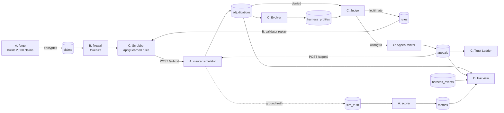

# Claim Cipher: how the whole system works

A plain-language guide to what we store in MongoDB and what each role (A, B, C, D) does.
For Role A in more depth, see [ROLE_A_EXPLAINED.md](ROLE_A_EXPLAINED.md). For the full product plan, see [PLAN.md](PLAN.md).

---

## 1. The big picture in one paragraph

A hospital sends insurance claims to three insurers. The insurers deny some of them. Some denials are the hospital's fault (a missing number, a wrong modifier), and some are the insurer's fault (they deny something their own policy covers). Our agent watches every denial and learns to fix the hospital's mistakes before the next claim goes out. It spots the insurer's wrongful denials and appeals them with evidence, and it tunes its own settings over time. It never shows real patient data to the AI.



---

## 2. What we use in MongoDB

**Cluster:** the team's MongoDB Atlas cluster (version 8.0). The connection string lives only in each person's `.env`.

We use two databases, plus one throwaway database for testing.

### Database `denialfighter` (the main one)

The name comes from `MONGODB_DB` in `.env`, and every file gets it from `common/db.py`.

| Collection | What it holds | Written by | Read by | Now |
| --- | --- | --- | --- | --- |
| `claims` | The 2,000 hospital claims. Patient name, date of birth, member ID, SSN, address, phone and notes are **encrypted** (Queryable Encryption). | A (forge) | B (firewall), C (orchestrator), B (validator), D (safe fields only) | 2,000 |
| `policies` | Each insurer's published policy, one document per clause (12 clauses × 3 insurers, plus Payer C's version 2). Holds the clause text and a 384-number `embedding` for search. | A (forge, simulator) | C (Judge, Appeal Writer), D ("Why?" drawer) | 48 |
| `phi_tokens` | The link from a token like `PATIENT_0421` back to the real patient, **encrypted**. Used only to put the real name into a letter at the moment it's sent. | B (firewall) | B (firewall, `render_letter`) | 219 |
| `adjudications` | Every insurer decision: paid or denied, the denial codes (for example `CO-16 / M62`), the denial text, and the Judge's verdict. | C (orchestrator) | C (Judge, Evolver, validator), A (scorer), D | 700 |
| `rules` | Prevention rules the agent learned, such as "G0439 with no prior auth → attach the prior auth from records", with status `candidate`, `active`, `rejected` or `retired`. | C (Judge), B (validator) | C (Scrubber), D | 21 |
| `appeals` | Appeal letters (stored **tokenized**, never with real names), the evidence used, mode (`draft_only` or `auto_file`), status and outcome (`overturned` or `upheld`). | C (Appeal Writer), D (approve button) | C (appeal worker, Trust Ladder, Evolver), A (scorer), D | 92 |
| `harness_profiles` | One settings profile per insurer: how many clauses and comparables the Judge looks at, confidence bar, appeal strategy, auto-file permission, learned guardrails. | C (Evolver, Trust Ladder) | C (all agents), B (firewall), D | 3 |
| `harness_events` | The audit log: every rule proposed, promoted, rejected or retired; every profile change and rollback; every blocked PHI leak. Each has a written reason. | C, B | D (live view, "Why?" drawer) | 50 |
| `metrics` | The honest scoreboard, one row per insurer (plus `all`) every 30 seconds: acceptance rate, Judge precision and recall, appeal win rate, money recovered, PHI leaks. A **time-series** collection. | A (scorer) | D (scoreboard) | 12 |
| `sim_truth` | **Ground truth.** For every decision, what the simulator really did (legitimate or wrongful denial, which hidden rule). Also the 100 hashed PHI traps. Agents must never read this. | A (simulator, forge) | A (scorer) only | 800 |
| `phi_incidents` | Each time the leak detector blocked patient data on its way to or from the AI. | B (firewall) | A (scorer), C (Evolver) | 4 |
| `llm_calls` | One row per AI call with tokens and cost, for the cost-per-claim number. Empty because there's no LLM key in `.env` yet. | B (`common/llm.py`) | A (scorer) | 0 |
| `orchestrator_state` | Bookmark: the last claim ID the orchestrator took, so a restart carries on where it stopped. | C (orchestrator) | C | 1 |
| `evolver_state` | The Evolver's pending change, kept so it can check next cycle whether the change helped, and roll it back if not. | C (Evolver) | C | 1 |

Some collections are managed by MongoDB itself; nobody writes to them directly. `enxcol_.claims.esc` and `enxcol_.claims.ecoc` are Queryable Encryption's internal bookkeeping for `claims`. `system.buckets.metrics` is where MongoDB physically stores the time-series `metrics`.

**Search indexes:**
- `policies_vector` is an Atlas Vector Search index on `policies.embedding`, with filters on `insurer` and `current`. It lets the Judge find the clauses closest in meaning to a denial.
- `adjudications_vector` is a vector index on `adjudications`. When it has no embeddings, the code falls back to keyword search.

### Database `encryption`

| Collection | What it holds |
| --- | --- |
| `__keyVault` | The data encryption keys (8), themselves encrypted with the master key. The master key is the local file `master-key.key`. It's never in MongoDB or GitHub, and every teammate needs a copy to read claims. |

### Database `denialfighter_smoke` (temporary)

`scripts/smoke.py` creates this database, runs its test in it, and empties it at the end. The demo data is never touched.

### Who may read what

`common/db.py` gives each part of the system a role and refuses forbidden collections in code:

| Role name | Used by | Can't touch |
| --- | --- | --- |
| `agent_worker` | the agents and orchestrator | `sim_truth`, the key vault |
| `firewall` | tokenize, encryption | `sim_truth` |
| `forge` | Role A's data loader | the key vault |
| `simulator`, `scorer` | Role A's simulator and scoreboard | nothing blocked |

Atlas didn't let us create matching database users on this tier, so for now the check lives in code only.

---

## 3. How one claim flows, step by step

1. **Pick up.** The orchestrator takes the next claim from `claims` (for example `clm_00042`) and decrypts it.
2. **Hide the patient.** The firewall swaps the patient for a token (`PATIENT_0421`), keeps only an age band and a state, turns dates into "days ago", and drops the notes. From here on the AI only sees this tokenized claim.
3. **Fix known mistakes.** The Scrubber applies every `active` rule for that insurer. For example, it copies the prior-auth number from the hospital's records onto the claim.
4. **Submit.** The claim goes to the simulator's `POST /submit`. The answer (paid, or denied with codes) is stored in `adjudications`. The simulator separately writes the real reason to `sim_truth`.
5. **Judge the denial.** For a denial, the Judge reads the codes and text, searches that insurer's `policies`, finds similar claims that were paid, and checks for bursts of identical denials. It then labels the denial:
   - **legitimate:** our mistake. After 3 similar ones, it proposes a rule. The validator replays that rule over past claims and promotes it to `active` only if it would have prevented at least 3 denials without harming paid claims.
   - **wrongful_policy / wrongful_bulk:** the insurer's mistake. The Appeal Writer drafts a letter with the evidence.
   - **needs_review:** not sure, so a human looks.
6. **Appeal.** In `draft_only` mode the appeal waits for a human to click **Approve** in the live view. In `auto_file` mode it's filed straight away. The simulator answers `overturned` (money recovered) or `upheld`.
7. **Earn trust.** After 10 appeals in a row are won, the Trust Ladder lets that insurer auto-file. After 2 losses in a row, it takes that back.
8. **Improve itself.** Every 5 minutes (or 50 claims), the Evolver checks results and changes one setting per insurer, with a written reason. For example, Payer C only accepts word-for-word quotes, so it turned on `quote_clause_verbatim`. It reverts the change if things get worse.
9. **Score honestly.** Every 30 seconds the scorer compares what the agents did with `sim_truth` and writes `metrics`.
10. **Show it.** The live view streams every change to the browser as it happens, using MongoDB change streams.

---

## 4. Each role in detail

### Role A: Simulation and scoring (`forge/`, `sim/`, `scorer/`)

**Job:** provide a realistic world to fight against, and an honest scoreboard.

- **Forge (`forge/`)** turns Synthea's synthetic patients into 2,000 claims. It uses 40 real codes (ICD-10-CM diagnoses, HCPCS procedures), and tags 20% as `holdout` for fair scoring. In about 5% of the notes it plants fake patient details as traps. It loads everything into MongoDB (`python -m forge load`): encrypted claims, policies, and hashed traps.
- **Simulator (`sim/`, port 8001)** plays three insurers with different personalities:

  | Insurer | Personality | Planted wrongful behavior | What wins an appeal |
  | --- | --- | --- | --- |
  | Payer A | strict but fair | denies covered chronic-condition visits | citing the right clause number |
  | Payer B | algorithmic | fast bulk denials, including a wrong reason code | 2+ comparable paid claims and the denial pattern |
  | Payer C | changes its policy | denies chest or abdominal pain visits | quoting the current clause word for word |

  It has `/submit`, `/appeal`, `/admin/policy-change/payer_c` (the demo button) and `/admin/policy-reset/payer_c`.
- **Scorer (`scorer/`)** is the **only** code allowed to read `sim_truth`. It writes true acceptance, Judge precision and recall, appeal win rate, money recovered and PHI leaks to `metrics`.

### Role B: MongoDB and security (`common/`, `firewall/`, `validator/`, `scripts/setup_db.py`)

**Job:** the shared foundation, plus keeping patient data away from the AI.

- **`common/`** holds the pieces every role imports:
  - database connection and role checks (`db.py`);
  - the agreed document shapes (`models.py`);
  - the rule language: which fields and fixes are allowed, and "never change diagnoses or raise charges" (`rules.py`);
  - policy search: vector, then keyword, then fixtures (`search.py`);
  - the AI client, which runs the leak detector on every request and response (`llm.py`);
  - reading and watching harness profiles (`profiles.py`).
- **`firewall/`** does four jobs:
  - encryption setup (`encryption.py`);
  - patient → token (`tokenize.py`);
  - the leak detector, which blocks SSNs, member IDs, names, dates of birth and so on, logging each block to `phi_incidents` (`guard.py`);
  - putting the real name back into an appeal letter only at the moment it's sent (`render.py`).
- **`validator/`** does two jobs:
  - replays a proposed rule over past claims before it goes live (`replay.py`);
  - moves rules through `candidate → active / rejected → retired` (`lifecycle.py`).
- **`scripts/setup_db.py`** creates all collections, indexes, the time-series `metrics`, the vector indexes and the encrypted `claims`.

### Role C: Agents (`agents/`, `orchestrator/`, `scripts/smoke.py`)

**Job:** the thinking loop.

| Agent | File | What it does |
| --- | --- | --- |
| Scrubber | `agents/scrubber.py` | Applies active rules before submitting. The fix is exact code, not AI guesswork. |
| Judge | `agents/judge.py` | Labels each denial as legitimate, wrongful or needs review, with evidence. Proposes rules from repeated legitimate denials. |
| Appeal Writer | `agents/appeal_writer.py` | Writes the appeal in the order the insurer's strategy says (clause first, comparables first…) and files it. |
| Evolver | `agents/evolver.py` | Changes one bounded setting per insurer per cycle, with a reason. Rolls back if the result gets worse. Can't touch permissions or fixed guardrails. |
| Trust Ladder | `agents/trust_ladder.py` | The only thing that can switch an insurer between draft-only and auto-file. |

- **`orchestrator/`** runs the loop at about 2 claims per second (`python -m orchestrator.main`).
  - The `appeal_worker` files human-approved appeals.
  - `claims_source` keeps the bookmark in `orchestrator_state`.
  - `contracts/sim_client.py` talks to the simulator. It falls back to a local stand-in, with a warning, only if the simulator is down.
- **`scripts/smoke.py`** is an end-to-end test of Learn, Judge, Fight and Evolve in its own temporary database.

Without `OPENROUTER_API_KEY`, every agent uses its built-in, deterministic rules. With a key, the Judge, Appeal Writer and Evolver use the LLM, and the Scrubber uses it for its short summary.

### Role D: Demo and product (`web/`, `scripts/seed_fake.py`, `scripts/reset_demo.py`, `README.md`)

**Job:** make it visible and demo-ready.

- **`web/api.py`** (port 8002) streams live changes from `adjudications`, `harness_events`, `appeals` and `harness_profiles` to the browser. It sends new scoreboard numbers every 5 seconds. It serves the "Why?" drawer's details, and the **Approve**, **Policy change** and **Reset** buttons. It never sends patient fields: claims are read with an allow-list.
- **`web/static/`** is the page itself, with four panels: claim stream, scoreboard, harness changes and appeals. It can be deployed to Vercel.
- **`scripts/seed_fake.py`** writes about 50 fake claims and events, so the page can be built before real data exists.
- **`scripts/reset_demo.py`** can save a snapshot of the run (`--save`), restore it (`--restore`), or wipe the run back to a cold start. It never deletes claims, policies or keys.

---

## 5. How the roles connect (the contracts)

| From → To | Through | What passes |
| --- | --- | --- |
| A → everyone | `claims`, `policies` | claims (encrypted) and policy clauses |
| B → C | `firewall.tokenize(claim)` | a tokenized claim with no patient identifiers |
| C → A | `POST /submit`, `POST /appeal` | tokenized claim or appeal → decision |
| B → C | `common.rules`, `validator.replay`, `common.search` | rule checking and fixing, rule testing, policy search |
| C → D | `adjudications`, `appeals`, `rules`, `harness_events`, `harness_profiles` | everything the agents decide |
| D → C | `appeals.status = "approved"` | a human's approval |
| D → A | `/admin/policy-change/payer_c` | the policy-change button |
| A → D | `metrics` | the honest scoreboard |

---

## 6. Running it

```bat
python scripts/setup_db.py          :: once: collections, indexes, encryption (B)
python -m forge load                :: once: claims, policies, PHI traps (A)
python -m sim                       :: terminal 1: insurers on :8001 (A)
python -m scorer                    :: terminal 2: scoreboard every 30 s (A)
python -m orchestrator.main         :: terminal 3: the agent loop (C). Only one per cluster!
python -m web.api                   :: terminal 4: live view on http://localhost:8002 (D)
python scripts/reset_demo.py        :: cold start before the demo (D)
```

## 7. Results from the live test on Sept 26

| Measure | Value |
| --- | --- |
| Claims processed | 700 |
| Acceptance, first 300 claims | 75% |
| Acceptance on held-out claims, after learning | 84% |
| Judge precision / recall | 100% / 100% |
| Rules learned and promoted | 5 fix types across 3 insurers |
| Appeal win rate | 90% (Payer C rose after the Evolver turned on verbatim quotes) |
| Money recovered | about $29,000 |
| Patient data leaked to the AI | 0 (2 attempts blocked) |
